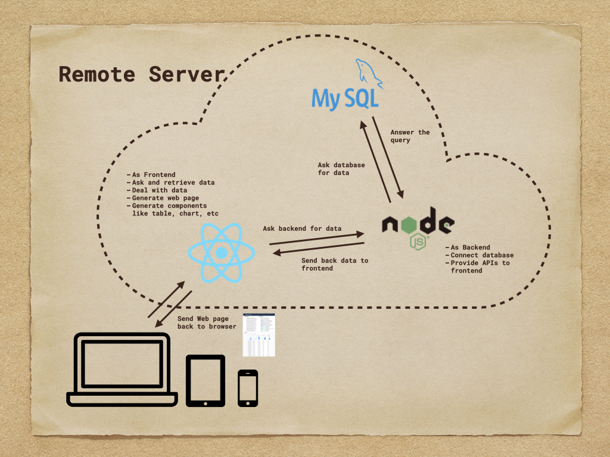

- A data table webpage for "Corrected Earthquake Data of Turkey in 1910-2017".
- This is a data management project focus on data storing, requesting, and managing (sorting and filtering).

## Demo
[Demo website](http://106.14.216.118:3000/)

## Tech Features

- Store and Request Data in MySQL
- Backend server built by Nodejs with express.js
- Frontend built by React, Antd, and Less
- Implement data sort and filter by SQL request
